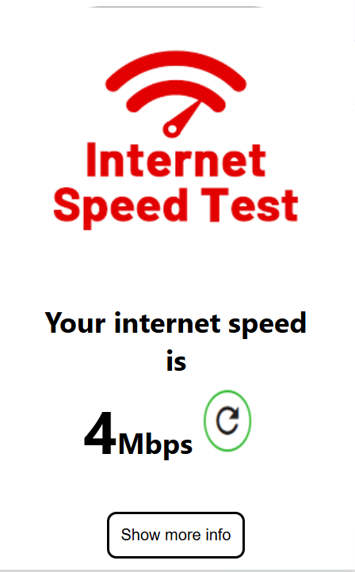

# 🚀 Internet Speed Checker (Chrome Extension)

A simple and lightweight Chrome extension to check internet speed with a clean UI.

---

## 📌 Features

- ⚡ One-click internet speed check  
- 🎯 Simple and user-friendly UI  
- 📦 Lightweight Chrome extension  
- 🔄 Dynamic speed display  

---

## 📸 Screenshots

### 🔹 Extension Popup

### 🔹 Speed Result

---

## 🛠️ Tech Stack

- HTML  
- CSS  
- JavaScript  
- Chrome Extension (Manifest V3)  

---

## ⚙️ Installation

1. Download or clone this repository  
2. Open Chrome → `chrome://extensions/`  
3. Enable **Developer Mode**  
4. Click **Load Unpacked**  
5. Select the project folder  

---

## 📂 Project Structure
📁 internet-speed-extension
┣ 📄 index.html
┣ 📄 index.js
┣ 📄 index.css
┣ 📄 manifest.json
┣ 📄 favicon.ico
┗ 📁 screenshots

---

## 🚀 Future Improvements

- 📡 Real-time speed testing  
- 📶 Network details (ping, type)  
- 🎨 Improved UI/UX  

---

## 🙌 Author

**Ganesh**